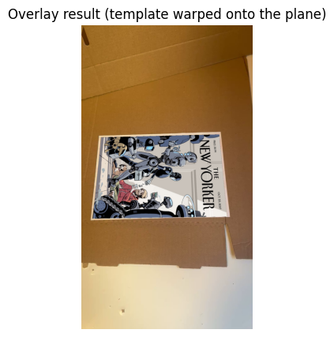
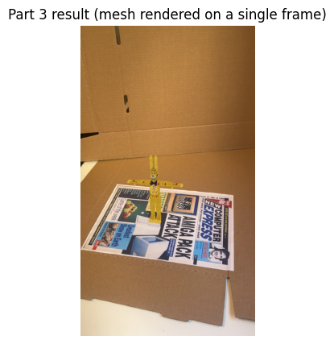
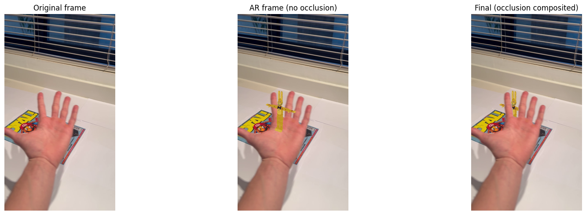
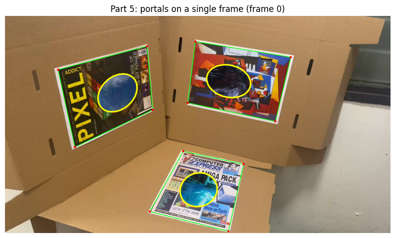

## Planar Augmented Reality (Computer Vision Project)

### Video Results
[Click here to view the videos (Google Drive)](https://drive.google.com/drive/folders/1Z0hUGtW1wzkdcgsVf_CUyesgSnEFWKU1?usp=drive_link)

### Project Report
[Click here to view the videos (Google Drive)](https://drive.google.com/file/d/1I1TPNkq9C81W2IA9ZLPm8-R-WemLetJx/view?usp=drive_link)

---

A classical computer vision project for **planar augmented reality** (no deep learning).
The system tracks planar targets in video and renders virtual content with correct perspective, pose, and occlusion.

## Project Overview
This project implements 5 parts:

- **Part 1**: Planar tracking (SIFT → matching → RANSAC homography) + template warp
- **Part 2**: Camera calibration (chessboard) + AR cube (pose via `solvePnP`)
- **Part 3**: AR 3D mesh rendering on the planar target
- **Part 4**: Occlusion handling (foreground mask → composite)
- **Part 5**: Multi‑plane tracking (3 targets) + portal / portal360 visualization

## Features
- **Classical CV pipeline**: SIFT/ORB, RANSAC, `solvePnP`, projection
- **Stable tracking**: optional temporal smoothing + hold-frames logic
- **3D rendering**: cube + full mesh rendering (wireframe / flat shading)
- **Occlusion**: HSV foreground mask + morphology + compositing
- **Multi-target**: track 3 planar references simultaneously and render portals

---

## Method (How it works)

### Part 1 — Planar tracking + template warp
- Detect SIFT features in the reference image.
- Detect SIFT features in each video frame and match descriptors (KNN + Lowe’s ratio test).
- Estimate a homography \(H\) using RANSAC and project the 4 reference corners onto the frame.
- Warp the template into the frame using \(H\) and composite it on the detected quadrilateral.

### Part 2 — Camera calibration + AR cube
- Detect chessboard corners across calibration images and calibrate camera intrinsics \(K\) + distortion `dist`.
- For each video frame: track the planar target to get 4 image corners.
- Define corresponding 3D plane corners (Z=0) and estimate pose with `solvePnP`.
- Project a 3D cube with `projectPoints` and draw it on the frame.

### Part 3 — AR mesh rendering
- Reuse Part 2 pose estimation (planar tracking → `solvePnP`).
- Load a 3D mesh and transform it to sit on the plane (scale / offset / rotation).
- Project mesh vertices to the image and render (wireframe or flat shading + painter’s ordering).

### Part 4 — Occlusion
- Render the AR mesh frame (same style as Part 3).
- Compute a foreground mask using HSV thresholding + median + morphology (open/close) and optional dilation.
- Composite: where mask==foreground keep the real frame, otherwise show the AR render.

### Part 5 — Multi‑plane portals
- Compute frame features once (SIFT or ORB).
- For each reference: match → RANSAC homography → corners → pose (`solvePnP`), with optional temporal smoothing.
- Render a portal on each detected plane.
- Optional portal360: map an equirectangular environment image inside the portal based on the estimated camera pose.

---

## Repository note (important)
Large media assets (videos / calibration images) are not always committed to GitHub.
If you want to reproduce results locally, download the assets from the Drive link and place them under `data/`.

---

## Quick start

From inside `augmented-reality-planar/`:

```bash
pip install -r requirements.txt
python main.py --part 1
python main.py --part 2 --mode both
python main.py --part 3
python main.py --part 4
python main.py --part 5 --part5_mode portal
```

---

## Clean notebooks (recommended)
These notebooks are aligned with the actual code and show the pipeline step-by-step:

- `01_Part1_Planar_Tracking_and_Warp.ipynb`
- `02_Part2_Calibration_and_AR_Cube.ipynb`
- `03_Part3_AR_Mesh_Rendering.ipynb`
- `04_Part4_Occlusion_Masking.ipynb`
- `05_Part5_MultiPlane_Portals.ipynb`

Notes:
- Parts 2–5 include `frame_idx` to pick a specific frame for debugging.

---

## Results (sample images)

### Part 1 — Tracking + warp



### Part 2 — Calibration + cube


### Part 3 — Mesh render


### Part 4 — Occlusion



### Part 5 — Multi‑plane portals


---

## Project Structure

`augmented-reality-planar/`
```
augmented-reality-planar/
  main.py              # Runner / orchestration for Parts 1–5
  config.py            # Central configuration (paths + parameters)
  tracker.py           # Planar tracking (features + matching + homography)
  camera.py            # Calibration utilities + NPZ I/O
  ar_render.py         # 3D rendering utilities (cube + mesh)
  occlusion.py         # Foreground mask + compositing (Part 4)
  multiplane.py        # Multi-plane tracking + portals (Part 5)
  docs/images/         # README images (small screenshots for GitHub)
  outputs/             # Generated videos + calibration
```

---

## CLI options (useful)
- **Part 2**: `--mode calib | cube | both`
- **Part 3**: `--model_path ...`, `--model_out ...`, `--rotate_x_deg ...`, `--rotate_y_deg ...`, `--rotate_z_deg ...`
- **Part 5**: `--part5_mode raw | outline | portal | portal360`, `--part5_out ...`
